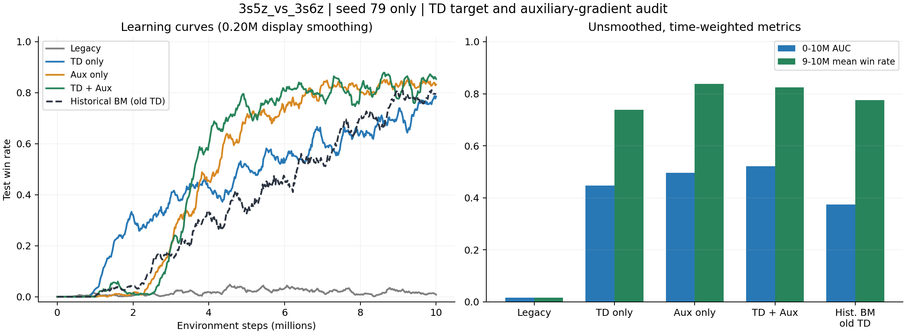

# 2026-10-02：TD(λ) / 辅助 hidden 梯度四组实验核查

数据目录：`D:\科研\ablation_results`。相较 2026-10-01 的 84 组记录，新增 4 组，总计 88 组；未删除旧记录。新增运行全部为 `3s5z_vs_3s6z`、seed79。

## 结论

这轮结果值得继续做有限配对复验。旧行为对照仍陷入低胜率，三组修正均恢复了学习；两项同时修正的 0–10M AUC 最高，仅辅助隔离的 9–10M 平均胜率最高。当前证据支持“实现路径影响了 seed79 的失败”，尚不支持跨种子稳定增益、两项修正普遍最优或 DVD 路由的独立贡献。

| 方案 | 0–10M AUC | 3–5M 胜率 | 7–9M 胜率 | 9–10M 胜率 | 最后一次评估 |
| --- | --- | --- | --- | --- | --- |
| 原行为对照 | 0.0169 | 2.18% | 1.67% | 1.62% | 0.00% |
| 仅修正 TD(λ) | 0.4479 | 42.99% | 64.31% | 73.91% | 75.00% |
| 仅隔离辅助 hidden 梯度 | 0.4966 | 45.97% | 82.35% | 83.80% | 93.75% |
| 两项同时修正 | 0.5209 | 55.84% | 81.87% | 82.41% | 96.88% |
| 历史 BM（旧 TD，仅参考） | 0.3747 | 28.80% | 67.19% | 77.55% | 71.88% |

AUC 为胜率曲线的时间积分除以 10M；各区间胜率使用时间加权平均，窗口边界线性插值。同 step 重复记录保留 wall_time 最新者。最后单点评估仅用于展示，选择方案以 AUC 和完整尾段为主。

## 覆盖与可比性

| 方案 | 最后评估步 | 配置开关 TD / Aux | Sacred 状态 |
| --- | --- | --- | --- |
| 原行为对照 | 10050181 | False / False | RUNNING |
| 仅修正 TD(λ) | 10046901 | True / False | RUNNING |
| 仅隔离辅助 hidden 梯度 | 10044533 | False / True | RUNNING |
| 两项同时修正 | 10040784 | True / True | RUNNING |

四组评估均超过 10M，覆盖所比较的全部区间；aux/both/td 的最后评估略低于配置总预算 10.05M，不能据此声称完整训练进程已结束。所有元数据仍为 RUNNING，且没有 stop_time。此处只判断已复制日志的评估覆盖，不推断服务器进程状态。四组全部标量均有限，没有事件解析异常。

逐组 Sacred 配置除 name 和两个实验开关外完全一致；TensorBoard 记录的开关也分别为 0/0、1/0、0/1、1/1。四组的 20 个 manifest 文件逐一与实际保存的源码/资源 SHA-256 一致；源码及 YAML 在忽略 Windows/Linux 换行差异后与本地 b7d1d30 相同。运行元数据没有 Git repository 信息，所以版本核对以文件快照与哈希为依据。

legacy 与旧 safe-v2 seed79 的胜率曲线逐点一致，全部 53 个共有标量标签也逐点一致。这加强了关闭开关的复现证据，而不仅是胜率区间近似相同。

## 两项修正分别带来了什么

仅 TD：AUC 从 0.0169 升至 0.4479，尾段从 1.62% 升至 73.91%；前期启动最快，1–3M 时间均值为 24.50%。这支持末尾/边界目标处理对本 seed 的学习有实质影响。修正同时处理最后有效步、终止、截断和 padding，本轮不能进一步将收益只归因于其中一项。

仅辅助隔离：AUC 达 0.4966，尾段 83.80%；在旧 TD 下也能解除 seed79 的失败，说明原辅助损失到 agent hidden 的梯度路径值得认真处理。

两项同时修正：AUC 为 0.5209，比仅辅助隔离高约 0.0243；尾段 82.41%，比仅辅助隔离低约 1.38 个百分点。3–5M / 5–7M 更强，因此累计学习效率最好。单 seed 的差异不足以证明两个开关收益可相加或某个方案普遍最优。

## 机制诊断

| 方案 | Gate 均值 | Gate 标准差 | Gate/标签相关性 | DVD 绝对 TD 优势 |
| --- | --- | --- | --- | --- |
| 原行为对照 | 0.0907 | 0.0418 | 0.1886 | -0.00308 |
| 仅修正 TD(λ) | 0.1275 | 0.0179 | 0.0811 | -0.00450 |
| 仅隔离辅助 hidden 梯度 | 0.1309 | 0.0144 | 0.0564 | -0.00472 |
| 两项同时修正 | 0.1302 | 0.0138 | 0.0642 | -0.00605 |

以上为 9–10M 时间均值。修正后三组 gate/标签相关性约 0.056–0.081，仍较弱；DVD 平均绝对 TD 优势仍为负。胜率恢复并没有同时提供路由监督已经有效跟随、DVD 专家平均更优的证据。不同方案访问的轨迹分布已经改变，跨运行 TD loss 的绝对大小不能直接当作策略质量排名。

## 历史 BM 与下一轮

历史同 seed BM 的 AUC 为 0.3747，尾段 77.55%。两项同时修正分别高约 0.1462 和 4.86 个百分点，但历史 BM 使用旧 TD 目标。正式比较必须补同样启用 TD 修正的 BM；若 BM 也因目标修正提高，就需要重新判断 DVD 的独立增量。

当前优先补 `dvd_audit_bm` + `audit_fix_td_lambda=True` 的 seed79 对照，并将两项同时修正扩展到 seed80/81/82；之后补齐相同 TD 修正的 BM 80/81/82，形成四种子的严格配对。若资源有限，先做 seed79/80 的配对。保留 seed82 和失败结果。基础 DVD 的 TD 开/关复验属于下一优先级，暂不扩展 gate 超参。

## 文件

`runs.csv`：新增四组的覆盖和胜率窗口；`details.json.gz`：原始标量与配置；`source_verification.json`：源码核查和旧行为逐点复现；`config_and_diagnostics.json`：配置与后期诊断；`historical_controls.json.gz`：旧 safe-v2 和 BM 的参照曲线。所有输出仅写入本地分析目录，原始实验记录未改动。
