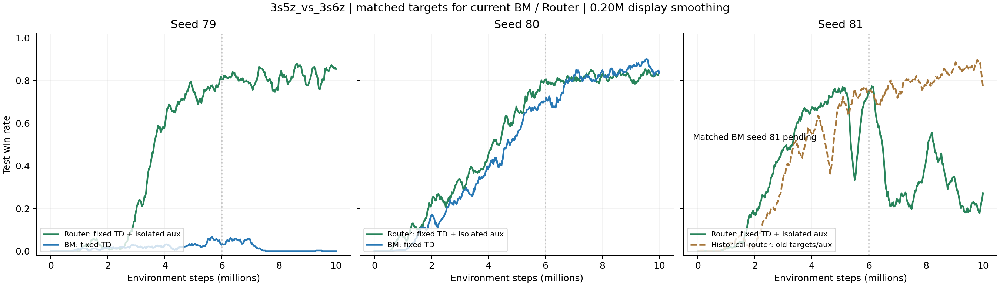

# 2026-10-03：修正版 BM 配对与 Router seed81 回退分析

目录为 `D:\科研\ablation_results`。本轮总计92份 Sacred 配置，相较上次新增4个运行：修正版 BM79/80 与双修正版 Router80/81。全部8个 audit 运行的评估已覆盖10M，全部标量有限，无事件解析异常。Sacred 仍为 RUNNING，不能据此判断实际进程是否已经退出；比较使用已有的0–10M完整区间。

## 主要结果

| Seed | Router AUC | 修正版 BM AUC | Router 9–10M | 修正版 BM 9–10M |
| --- | --- | --- | --- | --- |
| 79 | 0.5209 | 0.0177 | 82.41% | 0.03% |
| 80 | 0.5313 | 0.4940 | 82.61% | 85.87% |
| 81 | 0.3665 | 待跑 | 22.38% | 待跑 |

seed79：Router显著改善该次运行，修正版 BM 却落入低胜率。seed80：Router AUC 增加0.0373，后期低3.26个百分点，表现为累计学习效率改善而非后期全面优于 BM。seed81：Router 3–5M胜率64.19%，5–7M为53.50%，7–9M为34.56%，9–10M为22.38%，存在持续回退。该 seed 的同目标 BM 尚缺，不能断言回退是 Router 特有。

79/80的严格配对均值：Router AUC 0.5261，BM 0.2558；尾段 82.51% / 42.95%。均值优势主要来自 BM79 失败，不足以认定普遍优势。Router三个种子均值不可与仅两个种子的 BM 均值直接作公平比较。



## 可比性与源码检查

逐个核对8组各20份manifest文件：SHA-256均与实际源码/资源快照一致，忽略Windows/Linux换行格式后均与本地b7d1d30相同。BM和Router使用同一个新learner、相同TD修正、epsilon、RND、target软更新、优化器和训练预算；方法专属参数不同，算法配置外不存在共享训练参数差异。BM的takeover_bm_abs=False，warm-up=20M，事件takeover_alpha_mean始终为0，确认为训练期间纯BM。开关记录与配置一致。

历史 BM79（旧目标）AUC0.3747、后期77.55%，新BM79 AUC0.0177、后期0.03%；新BM80仍能达到85.87%。目标计算正确不保证每个有限预算运行都更好，目标修正也会改变学习轨迹。现有数据不支持把旧目标恢复为正式主结果；旧代码没有完整快照，历史比较是排查线索。

旧safe-v2 seed81后期87.07%，当前双修正版22.38%。两个开关一起改变，现阶段不能确定由TD边界处理、辅助hidden梯度隔离、mixed分支或其交互造成回退。

## 机制诊断

| Seed | Gate均值 | Gate/标签相关性 | DVD平均绝对TD优势 |
| --- | --- | --- | --- |
| 79 | 0.1302 | 0.0642 | -0.00605 |
| 80 | 0.1308 | 0.0724 | -0.00516 |
| 81 | 0.1311 | 0.0733 | -0.01117 |

三个种子的gate均值均约0.13，gate/标签相关性约0.064–0.073；seed81的DVD平均绝对优势更负。这提供排查线索，不能证明是回退原因。不同训练访问分布上的TD误差也不能直接比较为因果证据。6M处RND衰减归零，图中竖线只标明该已知时间点，不表示已识别回退由RND导致。

## 下一轮四卡

| GPU | 任务 | 目的 |
| --- | --- | --- |
| 0 | 3s 修正版 BM seed81 | 区分两种方法共同失败与Router特有回退 |
| 1 | 3s Router aux-only seed81 | 与已有both81只差TD开关，定位目标处理变化的影响 |
| 2 | 6h 修正版 BM seed79 | 跨地图配对基线 |
| 3 | 6h Router both seed79 | 冻结主配置的跨地图验证 |

aux-only故意保留旧TD计算，仅作诊断，不能用它代替修正版BM的正式主比较，也不能将仅seed79的好结果作为选用旧目标的依据。所有命令使用已有配置和开关，无须修改训练代码。

```bash
CUDA_VISIBLE_DEVICES=0 python3 src/main_audit.py --config=dvd_audit_bm --env-config=sc2 with env_args.map_name=3s5z_vs_3s6z use_tensorboard=True seed=81 name=audit_bm_td_3s5z_vs_3s6z_s81 audit_fix_td_lambda=True audit_isolate_dvd_aux_hidden=False

CUDA_VISIBLE_DEVICES=1 python3 src/main_audit.py --config=dvd_audit_router --env-config=sc2 with env_args.map_name=3s5z_vs_3s6z use_tensorboard=True seed=81 name=audit_router_aux_3s5z_vs_3s6z_s81 audit_fix_td_lambda=False audit_isolate_dvd_aux_hidden=True

CUDA_VISIBLE_DEVICES=2 python3 src/main_audit.py --config=dvd_audit_bm --env-config=sc2 with env_args.map_name=6h_vs_8z use_tensorboard=True seed=79 name=audit_bm_td_6h_vs_8z_s79 audit_fix_td_lambda=True audit_isolate_dvd_aux_hidden=False

CUDA_VISIBLE_DEVICES=3 python3 src/main_audit.py --config=dvd_audit_router --env-config=sc2 with env_args.map_name=6h_vs_8z use_tensorboard=True seed=79 name=audit_router_both_6h_vs_8z_s79 audit_fix_td_lambda=True audit_isolate_dvd_aux_hidden=True
```

## 结果出来后的分支

若BM81同样回退，优先排查共同训练动力学；若BM81稳定而Router81回退，优先做counterfactual_mix_loss_weight=0的mixed更新消融。若aux-only81恢复，说明在该条件下TD处理变化是关键影响因素之一；若它也失败，需要再补TD-only81来检验辅助梯度隔离及两项交互，不能直接归因mixed。此后补3s BM/Router82与6h BM/Router80，再按跨地图结果决定补81/82与定向改动。保留全部失败结果，按配对AUC、尾段和回退幅度判断，暂不扫gate超参。

## 文件

runs.csv与details.json.gz保存全部audit运行；paired_metrics.json仅使用已完成配对79/80；source_verification.json保存逐文件核对；historical_reference/为从当前原始记录重新解析的历史对照；next_round_commands.sh保存本轮建议。原始日志与训练代码未改动。
