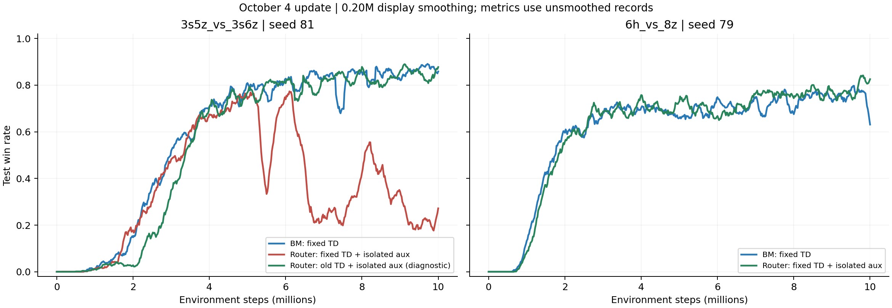

# 2026-10-04：seed81 定位与 6h 首组配对

原始目录 D:\科研\ablation_results：96份Sacred配置，较上轮新增4组。12组audit评估均覆盖10M，解析无异常、无NaN/Inf。旧8组事件系列与上轮逐点一致；12组共240份manifest文件均与实际快照及本地Git HEAD一致（仅忽略换行差异）。事件开关与配置一致。Sacred仍标记RUNNING，不能据此认定服务器进程已经退出。

## 正式修正版配对

| 地图 | Seed | Router AUC | BM AUC | Router 9–10M | BM 9–10M | 尾段差值 |
| --- | --- | --- | --- | --- | --- | --- |
| 3s5z_vs_3s6z | 79 | 0.5209 | 0.0177 | 82.41% | 0.03% | +82.38pp |
| 3s5z_vs_3s6z | 80 | 0.5313 | 0.4940 | 82.61% | 85.87% | -3.26pp |
| 3s5z_vs_3s6z | 81 | 0.3665 | 0.5884 | 22.38% | 86.55% | -64.17pp |
| 6h_vs_8z | 79 | 0.6086 | 0.6010 | 76.90% | 75.58% | +1.32pp |

3s三种子严格配对均值：Router AUC 0.4729、BM 0.3667；尾段 62.47%、57.48%，平均差值+4.98pp。但79/80/81的尾段差值分别为+82.38、-3.26、-64.17pp，两次落后、一次大幅领先。均值优势受BM79失败强烈影响，当前不能描述为稳定提升。

## 本轮确认和未确认的内容

3s seed81：修正版BM后期86.55%，双修正版Router22.38%；aux-only Router84.50%。aux-only与both的配置仅name和TD开关不同，因此在该种子、该辅助隔离条件下，改变TD目标处理伴随62.12pp的后期差异。它支持优先检查目标处理与Router更新的组合，而非判定修正公式数学错误。BM81正确目标仍能学好，也不能判定TD修正普遍有害。改变目标会改变后续采样轨迹，一次同种子配置比较没有识别唯一内部机制。

6h seed79：Router AUC0.6086、BM0.6010；尾段76.90%、75.58%，差值+1.32pp。最后一次评估84.38%对68.75%放大了差异，不能用单点评估代替尾段均值。当前可说该次跨地图配对未出现明显劣化，不能说已获得可靠提升。



## 下一轮四卡

| GPU | 实验 | 目的 |
| --- | --- | --- |
| 0 | 3s Router TD-only seed81 | 在正确TD下关闭辅助隔离，与已有both81比较；联合aux81定位开关组合 |
| 1 | 3s Router both，mix损失权重=0，seed81 | 保留正确TD和辅助隔离，测试mixed直接TD更新是否是必要影响因素 |
| 2 | 6h BM TD seed80 | 第二组跨地图配对基线 |
| 3 | 6h Router both seed80 | 检验首组1.32pp差异是否重复出现 |

无须修改或重新提交训练代码。GPU0、1均使用正确TD目标。GPU1只去掉mixed直接TD损失，BM价值损失从归一化系数0.8变为1.0，DVD辅助、route损失和推理时mixed组合仍保留；它不是纯BM，也不等同于推理阶段完全关闭DVD。目标仍由target BM锚定。辅助/route参数的全局梯度裁剪仍可能影响BM更新，因此不能宣称该实验与纯BM逐步完全相同。

```bash
CUDA_VISIBLE_DEVICES=0 python3 src/main_audit.py --config=dvd_audit_router --env-config=sc2 with env_args.map_name=3s5z_vs_3s6z use_tensorboard=True seed=81 name=audit_router_td_3s5z_vs_3s6z_s81 audit_fix_td_lambda=True audit_isolate_dvd_aux_hidden=False

CUDA_VISIBLE_DEVICES=1 python3 src/main_audit.py --config=dvd_audit_router --env-config=sc2 with env_args.map_name=3s5z_vs_3s6z use_tensorboard=True seed=81 name=audit_router_both_nomix_3s5z_vs_3s6z_s81 audit_fix_td_lambda=True audit_isolate_dvd_aux_hidden=True counterfactual_mix_loss_weight=0.0

CUDA_VISIBLE_DEVICES=2 python3 src/main_audit.py --config=dvd_audit_bm --env-config=sc2 with env_args.map_name=6h_vs_8z use_tensorboard=True seed=80 name=audit_bm_td_6h_vs_8z_s80 audit_fix_td_lambda=True audit_isolate_dvd_aux_hidden=False

CUDA_VISIBLE_DEVICES=3 python3 src/main_audit.py --config=dvd_audit_router --env-config=sc2 with env_args.map_name=6h_vs_8z use_tensorboard=True seed=80 name=audit_router_both_6h_vs_8z_s80 audit_fix_td_lambda=True audit_isolate_dvd_aux_hidden=True
```

## 下一轮之后如何决定

若TD-only81恢复，优先检查正确TD与辅助隔离组合；若nomix81恢复，则mixed直接价值更新是该条件下的重要影响因素，可在79或82复验，并再测试较小正权重（如0.05）而非直接把0权重作为最终方法。若两者都失败，先复验seed81与检查数据边界处理/学习率，不扩大gate网格搜索。所有结果只能定位当前配置条件下的因素，不能作为唯一因果机制证明。

若6h80再次只出现小差异，继续补81/82配对以判断方差；若明显落后，应保留跨地图局限并优先改进3s已定位的稳定性问题。后续补3s BM/Router82完成四种子；若方法调整，必须用同一最终配置重新组成完整配对，不能拼接各地图/种子最好的不同版本。

论文目前能支持的结论是结构在部分运行中有效、存在稳定性和目标处理敏感性；尚不能宣称两地图一致优越或两个实现修正都提升胜率。实现正确性、算法贡献和经验性能应分别陈述。少量运行应报告不确定性，参见[NeurIPS 2021评估研究](https://proceedings.neurips.cc/paper_files/paper/2021/hash/f514cec81cb148559cf475e7426eed5e-Abstract.html)。

## 保存内容

runs.csv/details.json.gz保存12组audit原始解析，paired_metrics.json保存配对结果，source_verification.json保存快照核验，config_comparison.json保存配对差异，next_round_commands.sh保存四卡命令。原始日志与训练代码未修改。
