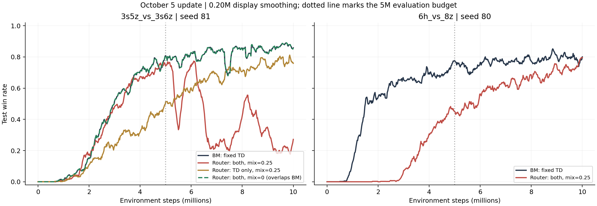

# 2026-10-05：mixed更新定位及5M候选筛选

原始目录D:\科研\ablation_results现有100份Sacred配置，较上次新增4组；16组audit评估全部覆盖10M，解析无异常、无NaN/Inf。前12组系列与10月4日逐点一致。16组共320份manifest文件、实际保存快照及本地训练代码核对一致（忽略换行格式），事件开关正确。Sacred仍标记RUNNING，此处仅判断已有评估覆盖，不判断服务器进程是否退出。

## 新结果与关键参照

| 运行 | 0–5M AUC | 4–5M胜率 | 0–10M AUC | 9–10M胜率 |
| --- | --- | --- | --- | --- |
| 3s81 BM | 0.3487 | 74.00% | 0.5884 | 86.55% |
| 3s81 Router both | 0.3360 | 70.27% | 0.3665 | 22.38% |
| 3s81 Router TD-only | 0.1875 | 41.36% | 0.4322 | 75.74% |
| 3s81 Router both / mix=0 | 0.3487 | 74.00% | 0.5884 | 86.55% |
| 3s81 Router aux-only（旧TD诊断） | 0.2903 | 71.83% | 0.5530 | 84.50% |
| 6h80 BM | 0.4781 | 70.07% | 0.6257 | 79.61% |
| 6h80 Router both | 0.1157 | 40.23% | 0.3719 | 73.86% |

3s seed81：关闭辅助隔离但保留正确TD时，尾段从22.38%恢复至75.74%，但仍低于BM86.55%；同时它的4–5M只有41.36%，低于both70.27%和BM74.00%，不适合作为5M主比较下的直接替代。

保留两项修正、将mixed直接TD损失权重设0时，尾段恢复至86.55%。不仅汇总相同，test_battle_won_mean全系列（步数和值）与BM逐点相同；19个共有标量中15个逐点相同，包括训练/评估回报、长度、q_taken_mean和target_mean，loss_td/td_error_abs/grad_norm及aux开关不同。这排除了只看终点巧合，但没有比较保存参数轨迹，不能把所有内部更新都称为已证明逐参数相同。

这一结果将排查重点指向mixed直接价值更新与其余更新的组合。权重从0.25变0时，BM价值损失归一化系数也从0.8变1.0，所以不能唯一归因某个具体梯度分量。分散执行用agent Q选动作，mixer用于训练；aux隔离后、mixed直接损失为0时DVD不直接训练agent/BM，因而这次得到BM一致轨迹是结构上可解释的结果。零权重是诊断对照，不能包装为DVD已产生性能增益。

6h seed80：Router学习明显变慢，4–5M40.23%对BM70.07%，差-29.84pp；0–5M AUC0.1157对0.4781。继续训练后追到9–10M73.86%，仍低于BM79.61%。改为5M比较不会消除该地图的问题。

6h79/80严格配对均值：4–5M Router 55.21%、BM 69.22%；0–5M AUC 0.2959/0.4803。9–10M均值 75.38%/77.60%，0–10M AUC 0.4903/0.6133。目前不能说当前Router在6h获得一致提升。



## 下一轮：四组固定小mixed权重，全部5M

仅将counterfactual_mix_loss_weight从0.25降到0.05，保留正确TD、辅助隔离、路由、学习率、RND及其6M衰减时钟。归一化后的value loss从0.2 L_mix+0.8 L_BM变为约0.047619 L_mix+0.952381 L_BM；这是损失系数，不是实际梯度幅度比例，也不是gate上限。选择一个非零候选以保留DVD参与agent训练，并降低已定位的mixed更新影响；它是否提升效果需要本轮验证。

| GPU | 地图、种子 | 问题 |
| --- | --- | --- |
| 0 | 3s79 | 是否仍保留对BM79失败轨迹的改善 |
| 1 | 3s81 | 是否在有限预算下至少恢复BM附近 |
| 2 | 6h79 | 是否保留首组接近BM的表现 |
| 3 | 6h80 | 是否解除启动明显变慢的问题 |

统一t_max=5050000，比较0–5M AUC与4–5M平均胜率。已有BM与原0.25权重运行直接截取前5M作同种子对照，不重跑基线。已读训练流程中t_max只决定终止，不重新缩放epsilon/RND等绝对步数时钟。5M81用于候选筛选，不能确认10M后期回退已消除；如候选在两个地图有效，再安排少量长训练复验。

```bash
CUDA_VISIBLE_DEVICES=0 python3 src/main_audit.py --config=dvd_audit_router --env-config=sc2 with env_args.map_name=3s5z_vs_3s6z use_tensorboard=True seed=79 name=audit_router_both_mix005_5m_3s5z_vs_3s6z_s79 audit_fix_td_lambda=True audit_isolate_dvd_aux_hidden=True counterfactual_mix_loss_weight=0.05 t_max=5050000

CUDA_VISIBLE_DEVICES=1 python3 src/main_audit.py --config=dvd_audit_router --env-config=sc2 with env_args.map_name=3s5z_vs_3s6z use_tensorboard=True seed=81 name=audit_router_both_mix005_5m_3s5z_vs_3s6z_s81 audit_fix_td_lambda=True audit_isolate_dvd_aux_hidden=True counterfactual_mix_loss_weight=0.05 t_max=5050000

CUDA_VISIBLE_DEVICES=2 python3 src/main_audit.py --config=dvd_audit_router --env-config=sc2 with env_args.map_name=6h_vs_8z use_tensorboard=True seed=79 name=audit_router_both_mix005_5m_6h_vs_8z_s79 audit_fix_td_lambda=True audit_isolate_dvd_aux_hidden=True counterfactual_mix_loss_weight=0.05 t_max=5050000

CUDA_VISIBLE_DEVICES=3 python3 src/main_audit.py --config=dvd_audit_router --env-config=sc2 with env_args.map_name=6h_vs_8z use_tensorboard=True seed=80 name=audit_router_both_mix005_5m_6h_vs_8z_s80 audit_fix_td_lambda=True audit_isolate_dvd_aux_hidden=True counterfactual_mix_loss_weight=0.05 t_max=5050000
```

本轮不要同时改辅助loss、学习率、RND或gate阈值，也不先扩展更多种子。若0.05在两地图都恢复且有非零DVD收益，再冻结候选补3s80/82及6h81/82配对。若只恢复BM附近而无增益，保留为稳定性消融。若6h80仍明显慢，先停止该维度细扫，转向mixed梯度路径的结构性诊断；当前不保证该候选会成功。已知失败种子保留在结果中。

少量训练运行应保留逐种子结果和不确定性，参见[NeurIPS 2021评估研究](https://papers.nips.cc/paper/2021/hash/f514cec81cb148559cf475e7426eed5e-Abstract.html)。

## 输出

all_budget_metrics.json包含16组双预算指标，6h_paired_metrics.json仅汇总已配对79/80，nomix_bm_equivalence.json保存逐点相同标签及核验范围，config_comparison.json/source_verification.json保存配置和源码核查，next_round_commands.sh保存建议命令。当前仅新增分析文件，训练代码、配置、原始记录及既有历史报告均未改动。
