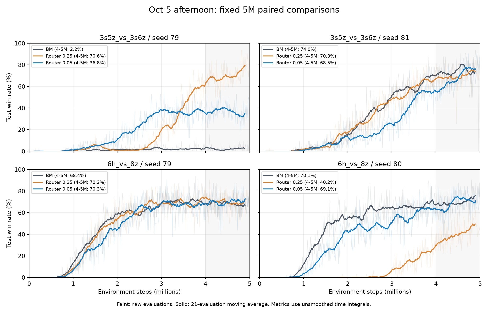

# 2026-10-06：10月5日下午四组小 mixed 权重实验

本轮结论：`counterfactual_mix_loss_weight=0.05` 明显缓解了 `6h` seed80 的学习迟缓，但损失了 `3s` seed79 的后段收益，且 `3s` seed81 学习更慢。它尚不满足作为两地图统一候选的条件。`6h` 后段恢复到 BM 附近，也不能解释为样本效率已优于 BM。

## 实验身份与数据核验

原始目录为 `D:\回放\ablation_results`，共104份 Sacred 配置、20组 audit TensorBoard 运行；较10月5日上午报告新增以下四组。时间按 Sacred UTC 加8小时转换，文件复制时间不用于认定实验启动时间。

| 地图 | Seed | 启动时间（北京时间，10月5日） | 评估点数 | 最后评估步数 |
| --- | ---: | --- | ---: | ---: |
| 3s5z_vs_3s6z | 79 | 15:39:56 | 500 | 5,047,329 |
| 3s5z_vs_3s6z | 81 | 15:40:22 | 498 | 5,040,716 |
| 6h_vs_8z | 79 | 15:40:45 | 502 | 5,048,207 |
| 6h_vs_8z | 80 | 15:41:05 | 502 | 5,047,763 |

四组评估均覆盖5M，训练预算为5,050,000；它们是完整的5M候选比较，不属于中断的10M实验。20组日志解析无异常、没有NaN/Inf。四组配置均开启正确 TD(lambda) 与辅助 hidden 梯度隔离，相比同地图同种子的旧 Router 只差实验名、mixed 权重0.25→0.05、停止预算10.05M→5.05M。

修改输出路径代码之前，已核验四组共80份 manifest 记录：SHA-256 均对应实际保存的 Python/YAML 快照，且与本地旧训练代码一致（忽略CRLF/LF）。该核验对应修改前的代码版本 `3c176c8`；之后的输出路径改动不属于这些运行的训练源码。

另以 Sacred `info.json` 交叉核对216个数值标量系列，共同步数上的值均符合 float32 精度。其中6h80的44个训练标签在TensorBoard多出最后一个5,048,822步记录，Sacred尚未写入；测试胜率502点完全一致，且差异在5M之外，不影响本报告统计。每组 `grad_norm` 在Sacred中为序列化对象，未反序列化；其TensorBoard数值仍检查有限。Sacred的RUNNING字段不能证明服务器进程此刻仍在运行。

## 固定5M比较

所有旧基线截取前5M；指标使用未平滑测试胜率，按环境步数做梯形积分，边界线性插值。同step重复记录保留最新wall_time。0–5M AUC为积分除以5M，范围0–1；4–5M为该窗口的时间加权平均胜率。首个评估在一次rollout之后，0至首个评估步数使用首个值作常值延伸，延续既有报告口径。

| 地图/Seed | BM AUC | 旧0.25 AUC | 新0.05 AUC | BM 4–5M | 旧0.25 4–5M | 新0.05 4–5M | 新−旧 |
| --- | ---: | ---: | ---: | ---: | ---: | ---: | ---: |
| 3s5z_vs_3s6z/79 | 0.0149 | 0.2372 | 0.2063 | 2.22% | 70.63% | 36.81% | -33.82pp |
| 3s5z_vs_3s6z/81 | 0.3487 | 0.3360 | 0.2698 | 74.00% | 70.27% | 68.50% | -1.78pp |
| 6h_vs_8z/79 | 0.4825 | 0.4762 | 0.4548 | 68.38% | 70.20% | 70.26% | +0.07pp |
| 6h_vs_8z/80 | 0.4781 | 0.1157 | 0.3940 | 70.07% | 40.23% | 69.12% | +28.90pp |

`3s` seed79：新权重较早学到部分胜率，2–3M均值24.61%高于旧版4.13%；但随后停留在约35–40%，旧版3M之后继续上升。4–5M从70.63%降到36.82%，下降33.82个百分点。新版权重仍优于失败的BM79，却没有保留旧Router的主要收益。

`3s` seed81：新版本4–5M为68.50%，低于旧版70.27%及BM74.00%；AUC从0.3360降为0.2698，也低于BM0.3487。差异主要来自中段学习慢，2–3M只有16.26%，对旧版32.38%、BM32.93%。在5M附近追近不等于全程恢复，更无法判断旧版9–10M退化到22.38%的问题是否消失。

`6h` seed79：4–5M为70.27%，与旧版70.20%基本一致，较BM68.38%高1.89个百分点；AUC却从旧版0.4762降到0.4548，低于BM0.4825。尾段小差异不能据此称为可靠提升。

`6h` seed80：是本轮明确改善的运行。4–5M从40.23%升到69.12%，增加28.90个百分点，距离BM70.07%约0.95个百分点；AUC从0.1157升到0.3940。但BM AUC为0.4781，1–2M新版本22.49%对BM41.05%，2–3M为46.14%对60.37%，样本效率仍落后。

曲线浅色为原始评估，实线为21个评估点移动均值（约0.2M），平滑只用于展示。灰色区间为4–5M。

## 同种子配对均值

| 地图 | 方法 | 共同种子 | 0–5M AUC | 4–5M胜率 |
| --- | --- | --- | ---: | ---: |
| 3s5z_vs_3s6z | BM | 79,81 | 0.1818 | 38.11% |
| 3s5z_vs_3s6z | Router_0.25 | 79,81 | 0.2866 | 70.45% |
| 3s5z_vs_3s6z | Router_0.05 | 79,81 | 0.2380 | 52.66% |
| 6h_vs_8z | BM | 79,80 | 0.4803 | 69.22% |
| 6h_vs_8z | Router_0.25 | 79,80 | 0.2959 | 55.21% |
| 6h_vs_8z | Router_0.05 | 79,80 | 0.4244 | 69.69% |

3s统一只配对79/81，不能拿新版本两种子均值与旧版79/80/81三种子均值比较。新版权重仍高于配对BM均值，优势主要来自BM79失败；相较旧Router，平均4–5M下降17.80个百分点。

6h统一配对79/80，新版本4–5M均值69.69%对BM69.22%，仅高0.47个百分点；AUC0.4244仍低于BM0.4803。只有两颗已用于诊断和选参数的种子，没有独立新种子或显著性证据；不能宣布跨地图可靠增益。

## 路由诊断的含义

新版本4–5M的实际gate均值为0.1198–0.1263，旧版为0.1276–0.1327。把mixed损失权重降为0.05并没有把实际gate固定到0.05；两者含义不同。归一化value loss从`0.2 L_mix + 0.8 L_BM`变为`0.047619 L_mix + 0.952381 L_BM`，这是损失系数，不能当作实际梯度比例。

新版本gate标准差0.0179–0.0230，gate与route target相关性0.0813–0.1022。存在样本间变化，但这些相关性较弱，不支持已学出强而有用的状态路由。正route比例约37.18–40.67%，仅说明存在满足阈值的样本；不能据此认定DVD改善了策略。

3s中DVD/BM平均绝对TD误差分别为0.17556/0.17386（79）、0.17063/0.16885（81），DVD仍略高；6h为0.25468/0.25666（79）、0.26214/0.26435（80），DVD略低。这些是各运行自身状态分布上的TD代理误差，不能直接作为策略因果收益或跨运行可比的外部质量指标。

结合先前mixed=0与BM81胜率全系列一致的诊断，这轮进一步表明：减少mixed更新影响可以恢复某个困难种子的训练，但不是权重越小越好，也未找到统一稳定的非零收益区域。改变权重同时调整mixed与BM的归一化系数，目前没有分支对共享agent的梯度夹角/范数测量，不能唯一归因到某一条内部梯度。

## 后续判断及本次代码改动

将0.05保留为稳定性消融，不直接冻结为两地图正式候选；也不据此为两张地图分别挑选权重后宣称通用性。下一步优先诊断mixed对共享agent的梯度路径与冲突，若先做额外验证，应明确验证的问题和预算，避免继续大范围扫描gate。已知0.25在3s81的10M回退应继续保留；0.05只跑到5M，长期稳定性尚未验证。本次没有启动新训练或修改学习算法。

按用户要求，后续保存默认改为项目根目录的 `ablation_results_10_6`。以已记录的服务器布局为例：`/home/zhangbei/pymarl2/ablation_results_10_6/`，包含`sacred/`、`tb_logs/`、`models/`。入口在启动时解析固定路径，把相同绝对路径交给所有保存逻辑。

可用Sacred参数`local_results_path=/data/your_experiment_root`指定准确的新根目录；相对路径从项目根目录解析，不依赖执行命令时的工作目录。默认不再追加到ablation_results；历史数据保留原位置。`save_model=False`默认值保留，开启时模型路径为`models/<unique_token>/<t_env>`，同时补全原默认runner中缺失的save_path创建逻辑。本次修改是本地代码，需要服务器使用更新后的文件才能生效。

## 输出路径修改的验证

新增路径测试7项全部通过；原审计CPU测试12项通过，1项真实Sacred文件保存测试因本机缺少Sacred跳过，总计19项通过、1项跳过。已覆盖固定默认目录、绝对/相对CLI覆盖、带空格与中文路径、审计observer与实际CLI路径一致、四种runner的TensorBoard调用及默认runner模型目录创建。默认/自定义目录的配置预览和Python语法检查通过，git diff --check通过。未进行真实SC2训练，也未在服务器部署。

已重算此前16组audit的0–5M AUC、4–5M、0–10M AUC、9–10M，与10月5日上午保存的指标全部一致（绝对容差1e-14；共64项），本轮新增数据没有改写这些历史比较值。

## 可复核输出

- `five_m_metrics.json`：12个逐运行对照的5M/10M覆盖、指标、1M窗口。
- `paired_metrics.json`：两地图共同种子均值。
- `config_comparison.json`、`source_verification.json`：参数与修改前源码核查。
- `diagnostics.json`、`sacred_tensorboard_checks.json`：训练诊断与双日志交叉核验。
- `details.json.gz`、`runs.csv`、`issues.json`：20组audit完整解析缓存与覆盖信息；解析脚本的`summary.json`为10M分组，不用于本轮5M候选汇总。
- `learning_curves.png/svg`：单种子曲线。
- `analyze_afternoon.py`、`write_report.py`：本轮重算脚本，依赖NumPy；绘图另需Matplotlib。原始解析使用`src/analysis/analyze_experiments.py`，依赖TensorBoard/protobuf。

原始日志未迁移、删除或改写。完整解析缓存保留在本地工作区，仓库只保存分析脚本、紧凑指标、核验记录和图表。
