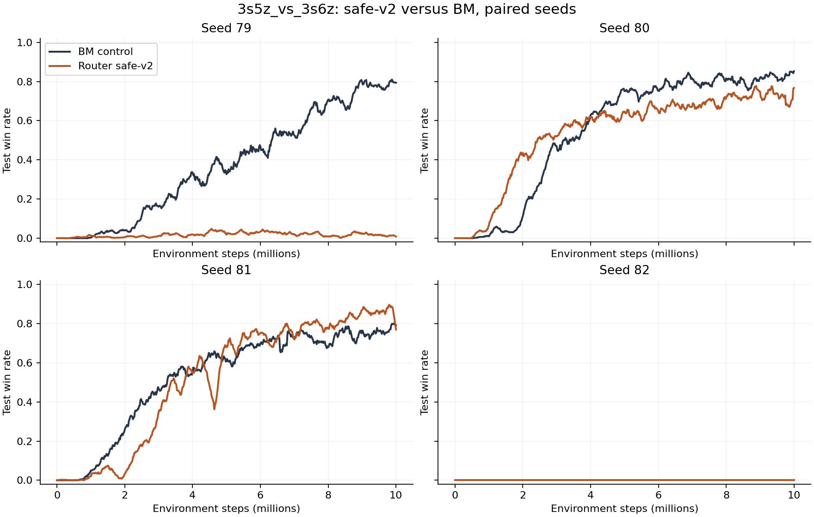
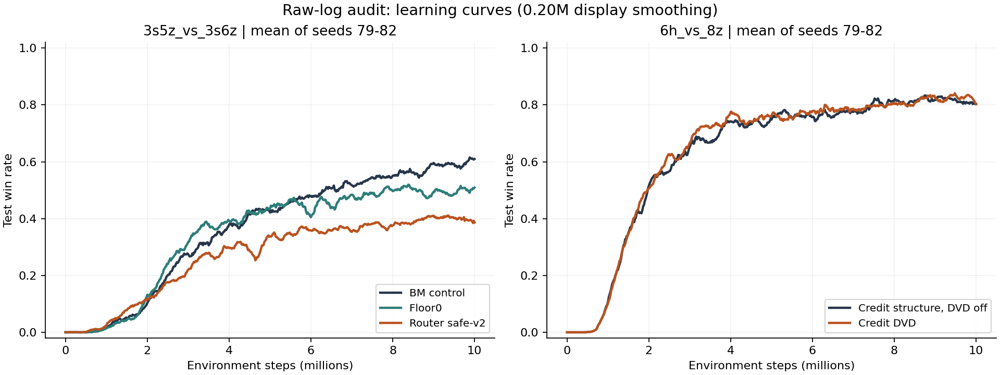

# 原始实验记录核查（2026-10-01）

数据目录：`D:\科研\ablation_results`。全部 84 个 TensorBoard 目录与 84 份 Sacred 配置一一匹配；两次日志创建时间比 Sacred start_time 晚 1 秒，使用唯一同名且相差不超过 2 秒的匹配。

80 个运行的胜率记录覆盖到 10M；其中 4 个修复前 Takeover 运行含 NaN，单独保留为数值失败记录。其余 4 个运行在约 5.1–5.4M 中断，不能推断它们的 10M 表现。正式 10M 分组表包含 76 个数值有限的运行。

Sacred 的 RUNNING 状态与记录已覆盖训练预算是两件事；这里以日志实际步数判断覆盖范围，不据此声称运行进程已退出。

统计口径：去重同 step 记录时保留 wall_time 最晚值；AUC 为 0–10M 胜率曲线梯形积分除以 10M；后期指标为 9–10M 时间加权平均。窗口边界线性插值，首条记录前使用首条胜率；本批运行首次评估均接近零步。所有主表保留 seed82，不按是否学起来删 seed。重复评估点不是独立种子。曲线平滑只用于绘图。

本文与旧文档少数数字不同，主要因为统一窗口边界、时间加权及使用全四种子。当前配置不能单独证明训练时的 learner/mixer 内部实现。

## 主要判断

- safe-v2 已运行到 10M，明显优于 aggressive-v1，但四种子 AUC 和后期胜率均低于 BM 对照。seed79 低胜率、seed80 接近但后期落后、seed81 后期有收益、seed82 两者都失败；不能把 seed81 单独作为稳定优势。

- Credit DVD 在 6h 的四种子结果较好，但同结构 DVD-off 对照几乎同样好。AUC 平均增量约 0.0092，9–10M 胜率增量约 0.0060，逐种子方向不一致；尚无可靠的 DVD 独立贡献证据。

- 旧基础组合在 3s5z 的正结果仅有 seed79；其 epsilon_start=1.0，而旧 BM 为 0.5，且 learner/RND/target 更新不一致。可保留为待复验候选，不能据此声称稳定优于 BM。

- 6h 基础组合 eps075 的 seed80/81 在约 5M 停止时仍零胜率；它们不是完整 10M 结果，但必须在稳健性讨论中保留。

- 优先修正当前实现已验证的 TD(lambda) 序列末尾奖励遗漏、辅助 DVD loss 的 hidden-state 梯度路径、直接 qmix_without_abs 分支的默认 abs 参数，再做必要的有限配对复验。当前记录没有保存 learner/mixer 源码，不能确认上述问题在历史服务器运行中是否完全相同。

## 3s5z 四种子完整结果

| 方法 | 种子数 | AUC | 跨种子样本SD | 9–10M胜率 | 跨种子样本SD |
| --- | --- | --- | --- | --- | --- |
| adaptive_cap02_3s5z | 4 | 0.1297 | 0.1531 | 0.1707 | 0.2175 |
| adaptive_takeover_3s5z | 4 | 0.2113 | 0.2462 | 0.2998 | 0.3459 |
| counterfactual_router_aggr_3s5z | 4 | 0.0614 | 0.1161 | 0.1226 | 0.2250 |
| counterfactual_router_safev2_3s5z | 4 | 0.2695 | 0.3016 | 0.4028 | 0.4597 |
| takeover_3s5z | 4 | 0.2786 | 0.2181 | 0.4681 | 0.3365 |
| takeover_floor0_3s5z | 4 | 0.3446 | 0.2407 | 0.4996 | 0.3389 |
| takeoveroff_3s5z | 4 | 0.3639 | 0.2551 | 0.5913 | 0.3952 |

## safe-v2 与 BM 的逐种子配对

| Seed | safe-v2 AUC | BM AUC | AUC差 | safe-v2后期 | BM后期 | 后期差 |
| --- | --- | --- | --- | --- | --- | --- |
| 79 | 0.0169 | 0.3747 | -0.3579 | 0.0162 | 0.7755 | -0.7593 |
| 80 | 0.5415 | 0.5536 | -0.0121 | 0.7243 | 0.8273 | -0.1030 |
| 81 | 0.5194 | 0.5273 | -0.0078 | 0.8707 | 0.7626 | 0.1081 |
| 82 | 0.0000 | 0.0000 | 0.0000 | 0.0000 | 0.0000 | 0.0000 |

## safe-v2 后期机制指标

| Seed | Gate均值 | Gate标准差 | Gate/标签相关性 | 正标签比例 | 绝对门槛通过比例 | 平均绝对优势 |
| --- | --- | --- | --- | --- | --- | --- |
| 79 | 0.0907 | 0.0418 | 0.1886 | 0.2308 | 0.2396 | -0.0031 |
| 80 | 0.1328 | 0.0175 | 0.0750 | 0.3924 | 0.4234 | -0.0046 |
| 81 | 0.1341 | 0.0168 | 0.0690 | 0.3676 | 0.3860 | -0.0031 |
| 82 | 0.0019 | 0.0034 | 0.1136 | 0.0035 | 0.0035 | -0.0002 |

这些是有效样本内统计量的 9–10M 时间均值。seed80/81 的 gate/标签相关性约 0.075/0.069，状态依赖监督跟随较弱；这不是严格常数 gate，但也不能仅凭 gate 均值接近标签均值证明路由有效。所有 seed 的平均绝对优势为负，不排除局部正优势，但需要区分局部拟合优势与策略改善。

## 6h Credit DVD 与关闭修正的对照

| Seed | DVD-on AUC | DVD-off AUC | AUC差 | DVD-on后期 | DVD-off后期 | 后期差 |
| --- | --- | --- | --- | --- | --- | --- |
| 79 | 0.5879 | 0.5977 | -0.0098 | 0.8128 | 0.7837 | 0.0291 |
| 80 | 0.6733 | 0.6861 | -0.0128 | 0.8380 | 0.8438 | -0.0058 |
| 81 | 0.6660 | 0.6361 | 0.0298 | 0.8595 | 0.8189 | 0.0406 |
| 82 | 0.6320 | 0.6024 | 0.0296 | 0.7828 | 0.8227 | -0.0398 |

四个 seed 的 Sacred 配置均只在 name 和 credit_gate_warmup_steps 上不同：DVD-on 为 1M，DVD-off 为 20M。在当前代码下，后者在 10.05M 训练中不启用 DVD 修正。Credit 构造会消耗额外初始化随机数，因此与更早的直接 matched_bm 运行不是同一初始化对照；DVD-on/off 配对更有解释力。

## 旧基础版和历史 BM（仅 seed79，配置未匹配）

| 地图 | 方法 | AUC | 9–10M胜率 | 最后单点评估 |
| --- | --- | --- | --- | --- |
| 3s5z_vs_3s6z | dvd_nqmix_on_3s5z_vs_3s6z | 0.5512 | 0.7911 | 0.9375 |
| 3s5z_vs_3s6z | nqmix_on_3s5z_vs_3s6z | 0.4596 | 0.7187 | 0.7500 |
| 6h_vs_8z | dvd_nqmix_on_6h_vs_8z | 0.4880 | 0.6927 | 0.7500 |
| 6h_vs_8z | nqmix_on_6h_vs_8z | 0.5536 | 0.8156 | 0.9375 |
| MMM2 | dvd_nqmix_on_MMM2 | 0.7462 | 0.9396 | 1.0000 |
| MMM2 | nqmix_on_MMM2 | 0.8477 | 0.9318 | 0.9062 |

## 不完整与数值失败记录

| 运行 | 最后评估步 | 最后胜率 | 记录中始终零胜率 |
| --- | --- | --- | --- |
| bm_6h_eps05_ann500k_s80 | 5425841 | 0.5000 | False |
| bm_6h_eps05_ann500k_s81 | 5307741 | 0.7812 | False |
| ours_6h_eps075_ann500k_s80 | 5074330 | 0.0000 | True |
| ours_6h_eps075_ann500k_s81 | 5373769 | 0.0000 | True |

- takeover_3s5z_s79__2026-09-20_10-33-47
- takeover_3s5z_s80__2026-09-20_10-34-12
- takeover_3s5z_s81__2026-09-20_10-34-23
- takeover_3s5z_s82__2026-09-20_10-34-38

## 全部完整、数值有限运行的分组汇总

| 地图 | 方法 | 种子数 | AUC | 9–10M胜率 |
| --- | --- | --- | --- | --- |
| 3s5z_vs_3s6z | adaptive_cap02_3s5z | 4 | 0.1297 | 0.1707 |
| 3s5z_vs_3s6z | adaptive_takeover_3s5z | 4 | 0.2113 | 0.2998 |
| 3s5z_vs_3s6z | counterfactual_router_aggr_3s5z | 4 | 0.0614 | 0.1226 |
| 3s5z_vs_3s6z | counterfactual_router_safev2_3s5z | 4 | 0.2695 | 0.4028 |
| 3s5z_vs_3s6z | creditdvd_3s5z | 1 | 0.0000 | 0.0000 |
| 3s5z_vs_3s6z | creditdvd_3s5z_nowarm | 1 | 0.0000 | 0.0000 |
| 3s5z_vs_3s6z | creditdvd_3s5z_nowarm_r100 | 1 | 0.0014 | 0.0136 |
| 3s5z_vs_3s6z | creditoff_3s5z | 1 | 0.0001 | 0.0006 |
| 3s5z_vs_3s6z | dvd_nqmix_eps05_on_3s5z_vs_3s6z | 1 | 0.3208 | 0.6714 |
| 3s5z_vs_3s6z | dvd_nqmix_on_3s5z_vs_3s6z | 1 | 0.5512 | 0.7911 |
| 3s5z_vs_3s6z | dvd_on_3s5z_vs_3s6z | 1 | 0.0004 | 0.0020 |
| 3s5z_vs_3s6z | dvd_on_3s5z_vs_3s6z_8头 | 1 | 0.0003 | 0.0013 |
| 3s5z_vs_3s6z | dvd_second_on_3s5z_vs_3s6z_8头 | 1 | 0.3524 | 0.6820 |
| 3s5z_vs_3s6z | nqmix_on_3s5z_vs_3s6z | 1 | 0.4596 | 0.7187 |
| 3s5z_vs_3s6z | resdvd_3s5z | 1 | 0.0218 | 0.1688 |
| 3s5z_vs_3s6z | resdvd_3s5z_agggate | 1 | 0.0000 | 0.0000 |
| 3s5z_vs_3s6z | resdvd_3s5z_agggate_tanh10 | 1 | 0.0004 | 0.0013 |
| 3s5z_vs_3s6z | takeover_3s5z | 4 | 0.2786 | 0.4681 |
| 3s5z_vs_3s6z | takeover_floor0_3s5z | 4 | 0.3446 | 0.4996 |
| 3s5z_vs_3s6z | takeoveroff_3s5z | 4 | 0.3639 | 0.5913 |
| 6h_vs_8z | bm_6h_eps075_ann500k | 1 | 0.5882 | 0.8063 |
| 6h_vs_8z | bm_6h_eps10_ann100k | 1 | 0.0000 | 0.0000 |
| 6h_vs_8z | creditdvd_6h | 4 | 0.6398 | 0.8233 |
| 6h_vs_8z | creditoff_6h | 4 | 0.6306 | 0.8173 |
| 6h_vs_8z | dvd_nqmix_eps05_on_6h_vs_8z | 1 | 0.0000 | 0.0000 |
| 6h_vs_8z | dvd_nqmix_on_6h_vs_8z | 1 | 0.4880 | 0.6927 |
| 6h_vs_8z | dvd_on_6h_vs_8z | 1 | 0.2307 | 0.5027 |
| 6h_vs_8z | dvd_second_on_6h_vs_8z_8头 | 1 | 0.0051 | 0.0206 |
| 6h_vs_8z | matched_bm_6h | 4 | 0.5120 | 0.6933 |
| 6h_vs_8z | nqmix_eps1_on_6h_vs_8z | 1 | 0.0000 | 0.0000 |
| 6h_vs_8z | nqmix_on_6h_vs_8z | 1 | 0.5536 | 0.8156 |
| 6h_vs_8z | ours_6h_eps075_ann500k | 1 | 0.5578 | 0.7936 |
| 6h_vs_8z | ours_6h_eps10_ann100k | 1 | 0.2368 | 0.5575 |
| 6h_vs_8z | resdvd_6h | 3 | 0.2728 | 0.5362 |
| 6h_vs_8z | resdvd_6h_scale05 | 3 | 0.2915 | 0.5329 |
| 6h_vs_8z | resdvd_6h_tanh10 | 3 | 0.2062 | 0.4350 |
| MMM2 | dvd_nqmix_on_MMM2 | 1 | 0.7462 | 0.9396 |
| MMM2 | dvd_on_MMM2_8头 | 1 | 0.6821 | 0.9133 |
| MMM2 | dvd_second_on_MMM2_8头 | 1 | 0.8129 | 0.9446 |
| MMM2 | nqmix_on_MMM2 | 1 | 0.8477 | 0.9318 |

## 可复核文件

- runs.csv：全部 84 个运行，含配置路径、事件目录、覆盖范围及异常标记。
- details.json.gz：全部标量序列、配置和元数据。
- paired_config_differences.json：逐种子配置差异。
- issues.json：两次 1 秒时间差匹配记录。
- analyze_experiments.py / report_experiments.py：重算脚本位于上级 analysis 目录。
